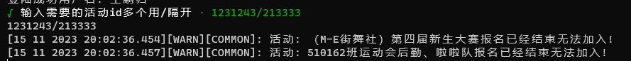
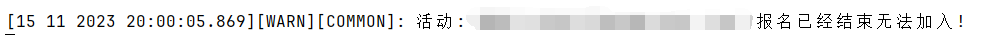

<p align="center">
  
</p>


## 完成进度
- [x] 登陆与认证
  - [x] 二维码登陆
  - [x] 账户密码登陆
  - [ ] 多账户登陆
- [x] 活动
  - [x] 报名活动
- [ ] 推送
  - [ ] 微信推送
- [ ] [对云崽Bot的插件](https://github.com/yoimiya-kokomi/Miao-Yunzai)
  - [ ] 二维码登录
  - [ ] 账号密码登录
  - [ ] 活动报名
## 使用方法

在使用前请确保你已安装[Nodejs v20.3.0](https://nodejs.org/en) 或以上版本，低版本应该也行

```shell
1. 克隆项目
git clone https://github.com/seiuna/pukoudai-client.git

2. 安装依赖
npm install -P

3. 运行
npm run app
```




## 后续计划
